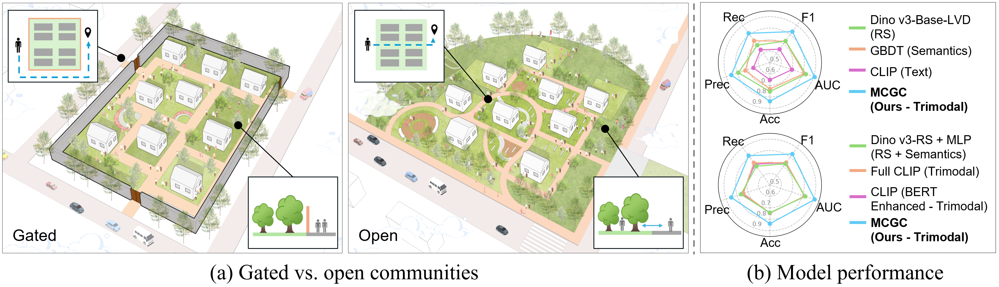
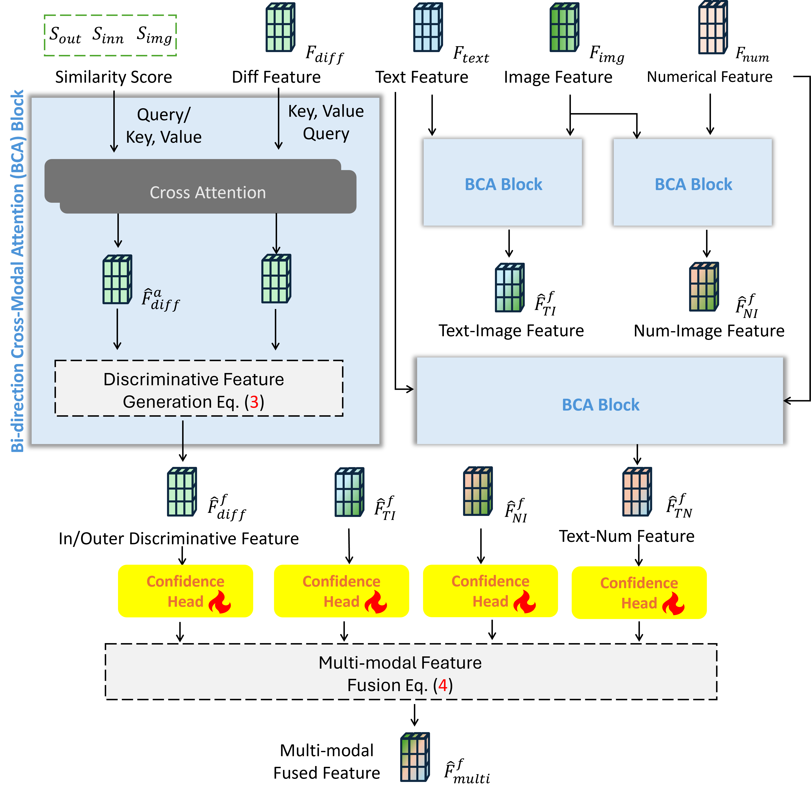

# GBA-GCs: Public Georeferenced Release

This repository contains the public, ethics-first release for the ECCV 2026 provisionally accepted paper:

**Urban Boundaries, Social Barriers: A Benchmark and Vision-Centric Framework for Mapping Gated Communities and Equity Implications** (Submission #11296).

<p align="center">
  
</p>

The public dataset provides gated/open labels, centroid coordinates, area, and coarse non-identifying attributes for **46,747** mainland residential AOIs in China's Greater Bay Area. Hong Kong and Macao are provided as a separate **10,323** AOI transfer-diagnostic file, not mixed into the mainland benchmark. The release is designed to support benchmark transparency and reconstruction while reducing risks from releasing precise residential boundaries, addresses, community names, raw map-provider metadata, or imagery.

## Overview

GBA-GCs is a public, boundary-free release built from the paper dataset and optimized for continued maintenance. It exposes enough spatial information for reproducible reconstruction and model auditing, while withholding raw AOI polygons, names, addresses, provider IDs, imagery, and provider-owned metadata.

<p align="center">
  
</p>

## Files

- `data/gba_gcs_mainland_public_georeferenced.csv`: georeferenced boundary-free labels and coarse attribute bins for the mainland GBA benchmark.
- `data/hk_macao_transfer_diagnostics_public_georeferenced.csv`: separate georeferenced Hong Kong and Macao transfer-diagnostic rows.
- `metadata/city_summary.csv`: city-level counts.
- `metadata/manifest.json`: source summaries, versioning, and public-release exclusions.
- `docs/DATASET_CARD.md`: dataset composition, intended use, limitations, and ethics notes.
- `docs/ETHICS_AND_ACCESS.md`: public vs controlled access policy.
- `docs/DATA_USE_AGREEMENT_TEMPLATE.md`: template for controlled non-commercial access requests.
- `docs/RECONSTRUCTION_WORKFLOWS.md`: Baidu/Amap and OSM/GEE reconstruction workflows.
- `model/`: reference MCGC inference API and model card.
- `model/CHECKPOINTS.md`: released checkpoint links, hashes, and use restrictions.
- `examples/`: minimal MCGC inference example.
- `code/README.md`: code and reconstruction notes.
- `assets/`: paper figures used for repository documentation.

## Projection And Source Notes

- Public coordinates are WGS84 longitude/latitude (`EPSG:4326`).
- `centroid_lon` and `centroid_lat` are AOI centroids, not AOI boundaries.
- `area_m2` is the AOI area in square meters from the projected/source AOI record.
- Mainland rows use provider-record WGS84 centroid fields when available.
- Hong Kong/Macao rows did not consistently include WGS84 centroid fields locally; their public centroids were computed from controlled projected AOI geometries and transformed from UTM Zone 50N (`EPSG:32650`) to WGS84.
- Controlled raw records may contain provider metadata such as community names, addresses, administrative fields, tags, provider IDs, AOI polygons, raster source names, and image metadata. These are not redistributed in this public repository.

## Public Schema

Each row is a georeferenced public record. The release includes centroid coordinates and area for reconstruction/matching. It does **not** include AOI polygons, names, addresses, provider identifiers, raw provider metadata, or imagery.

| Column | Description |
| --- | --- |
| `aoi_id` | Stable anonymous hash ID. |
| `city` | City-level location only. |
| `centroid_lon`, `centroid_lat` | WGS84 centroid coordinates for approximate spatial matching. |
| `area_m2` | AOI area in square meters, rounded to two decimals. |
| `label` | `gated` or `open`, generated by the validated MCGC model for the metropolitan-scale inference set. |
| `prediction_probability_gated` | Model probability rounded to four decimals. |
| `confidence_bin` | Coarse confidence category. |
| `area_bin`, `far_bin`, `poi_density_bin`, `poi_count_bin` | Coarse derived bins only. |
| `has_boundary_in_controlled_release`, `has_imagery_in_controlled_release` | Indicates whether the non-public controlled package contains restricted components. |

## Counts

Mainland benchmark AOIs: **46,747**.

Hong Kong/Macao transfer-diagnostic AOIs: **10,323**.

## Citation

If you use this release, cite the ECCV 2026 paper above. A BibTeX entry will be added after the official proceedings metadata is available.

## License And Access

This public georeferenced release is provided for non-commercial research and reproducibility. Controlled components, including AOI boundaries, names, raw imagery, and provider metadata, are not redistributed in this public repository.

## MCGC Reference Model

The `model/` folder contains a reference MCGC inference API. Remote-sensing imagery is required at inference time. Text and numerical features are optional and may be omitted through modality masks.

The ECCV 2026 MCGC checkpoint is distributed through GitHub Releases, not committed into the repository:

- Release: https://github.com/MinweiZhao/GBA-GCs/releases/tag/v2026-06-mcgc
- Asset: `trimodal_io_fused_gba_full.pth`
- SHA-256: `48518dafd9b2e2702db812ae9977bc6699bbc2e55c4a8044bd7d993114ebb1b8`

See `model/CHECKPOINTS.md` and `model/MODEL_CARD.md` before use.

<p align="center">
  
</p>

MCGC inputs:

- required: remote-sensing image tile, typically cropped around the reconstructed AOI with context buffer
- optional: text metadata embedding, e.g. name/tag/address descriptions when licensed and available
- optional: numerical/structured features, e.g. area, FAR, POI density, POI count
- optional masks: `has_text`, `has_numerical`; visual imagery cannot be missing

The paper model uses a DINOv3-SAT visual backbone with LoRA adaptation, an optional text encoder, structured-feature MLP, inner/outer visual context, and cross-modal community-aware fusion. The lightweight implementation in `model/mcgc_reference.py` is an API-compatible reference for downstream callers.

Minimal call:

```bash
PYTHONPATH=. python examples/run_mcgc_inference.py \
  --image_tensor example_image_tensor.pt \
  --output prediction.json
```
